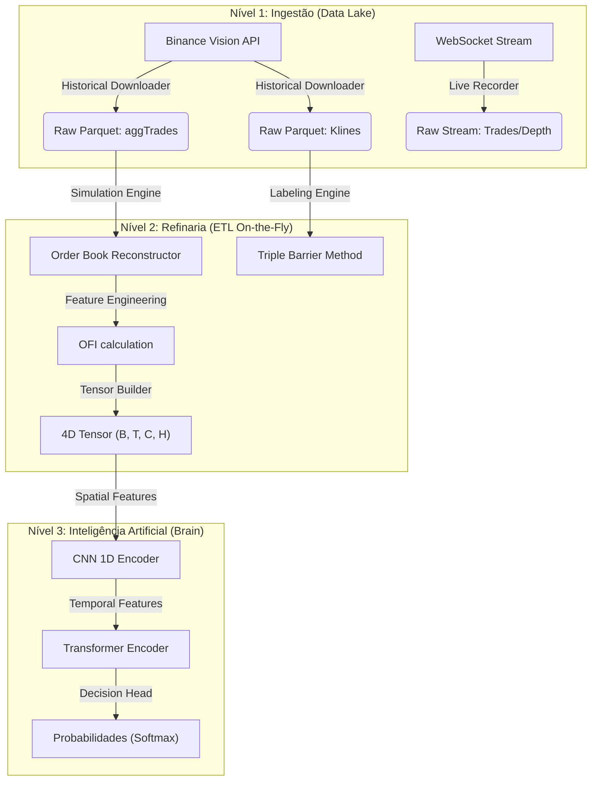

# 🧠 SAIMP: Single Artificial Intelligence Market Predictor

> **Versão**: 5.3 (The Monolith Edition)  
> **Status**: 🟢 Em Desenvolvimento (Treinamento & Validação)  
> **Dependência**: PyTorch + Polars + CUDA  
> **Filosofia**: "O Mercado não é uma linha 2D, é uma topografia 4D."


---

## 📋 Índice Mestre

1.  [Introdução e Filosofia (GeoAI)](#1-introdução-e-filosofia-geoai)
2.  [Arquitetura do Sistema](#2-arquitetura-do-sistema)
3.  [Capítulo I: Coleta de Dados (Data Ingestion)](#3-capítulo-i-coleta-de-dados)
4.  [Capítulo II: Estruturação e Simulação (Refinaria)](#4-capítulo-ii-estruturação-e-simulação)
5.  [Capítulo III: Labeling e Metodologia (Triple Barrier)](#5-capítulo-iii-labeling-e-metodologia)
6.  [Capítulo IV: O Cérebro (SAIMPViViT)](#6-capítulo-iv-o-cérebro-saimpvivit)
7.  [Capítulo V: Testes e Qualidade (QA)](#7-capítulo-v-testes-e-qualidade)
8.  [Capítulo VI: Cockpit Operacional (Live Trading)](#8-capítulo-vi-cockpit-operacional-live-trading)
9.  [Guia de Instalação e Configuração](#9-guia-de-instalação-e-configuração)
10. [Manual de Operação](#10-manual-de-operação)
11. [Estrutura do Projeto](#11-estrutura-do-projeto)
12. [Roadmap e Próximos Passos](#12-roadmap-e-próximos-passos)

---

## 1. Introdução e Filosofia (GeoAI)

**SAIMP** é um sistema de Inteligência Artificial projetado para decodificar a microestrutura do mercado de criptomoedas (Binance Futures) e identificar oportunidades de *Swing Trade* com alta precisão.

### 🚀 O Problema
A maioria dos modelos financeiros falha porque olha para o mercado como uma simples linha 2D (Preço x Tempo). Eles ignoram a **liquidez** (Order Book), que é o terreno onde o preço se move.

### 💡 A Solução: GeoAI & Visão 4D
Tratamos o mercado como um problema de **Visão Computacional**.
*   **Topografia (Order Book)**: As "montanhas" de liquidez passiva (Limit Orders) que oferecem resistência e suporte.
*   **Erosão (Execuções)**: O "fluxo de água" (Market Orders) que consome a liquidez e molda o terreno.

O objetivo da IA é assistir a esse "vídeo" geológico e prever onde ocorrerão os próximos deslizamentos de terra (rompimentos de preço).

---

## 2. Arquitetura do Sistema

O pipeline foi desenhado para processar Terabytes de dados históricos com latência mínima, utilizando **Rust (Polars)** para ETL e **CUDA (PyTorch)** para Deep Learning.



---

## 3. Capítulo I: Coleta de Dados

> **Referência**: `docs/COLETA_DADOS_README_CAP_I.md`

Este módulo é responsável pela ingestão bruta de dados com foco em **baixa latência** e **eficiência de armazenamento**.

### Stack Tecnológica
- **Data Engine**: `Polars` (Rust-backed, High Performance).
- **Storage**: `Apache Parquet` (Compressão `zstd`, Colunar).
- **Async I/O**: `asyncio`, `aiohttp`, `websockets`.

### Dicionário de Dados

#### A. Histórico (`data/raw/historical/`)
Dados oficiais da Binance Vision, consolidados mensalmente.

| Tipo | Nome do Arquivo | Conteúdo Principal | Uso |
|:---|:---|:---|:---|
| **Klines** | `klines_YYYY-MM.parquet` | OHLCV (1m), Volume, Taker Buy Vol | Contexto Macro, Tendência |
| **Trades** | `aggTrades_YYYY-MM.parquet` | Preço, Qtd, Tempo, IsBuyerMaker | Análise de Fluxo, OFI, Delta |

#### B. Streaming (`data/raw/stream/`)
Dados proprietários gravados em tempo real (Live Trading).

| Tipo | Conteúdo | Estrutura | Uso |
|:---|:---|:---|:---|
| **Depth** | Order Book (Top 20 levels) | **bids**: `[[price, qty], ...]`<br>**asks**: `[[price, qty], ...]` | Identificar Liquidez, Spoofing |
| **Trade** | Execuções em Tempo Real | Formato Binance Futures: `p` (price), `q` (qty), `T` (time), `m` (isMaker) | Sincronizar erosão da liquidez |

#### C. Otimizações Binance Futures
O coletor `src/collectors/stream.py` foi atualizado para suportar:
- **Multiplexed Streams**: Captura simultânea de trades e profundidade.
- **Normalização Automática**: Conversão de chaves curtas do WebSocket para o padrão do Data Lake.
- **Fragmentação Inteligente**: Gravação de arquivos compactos (chunks) para evitar perda de dados por queda de rede.

### Protocolo de Recuperação (Disaster Recovery)
1.  **PC Desligou?**: Reinicie o script `stream.py` imediatamente.
2.  **Gap**: O período offline será um "buraco" nos dados. O pipeline de treino ignorará janelas com gaps > 15min.
3.  **Backfill**: Use o `historical.py` para baixar dias perdidos quando disponíveis na Binance.

---

## 4. Capítulo II: Estruturação e Simulação

> **Referência**: `docs/ESTRUTURACAO_DADOS_README_CAP_II.md`

Este módulo transforma logs financeiros em **Tensores Quadridimensionais (4D)**.

### A. Simulação de Order Book (Volume Profile Reconstructor)
Como não temos o Order Book completo de anos passados, utilizamos o conceito de **Restauração de Perfil de Volume**:
*   **Trade = Erosão**: Cada trade agressivo "cavou" um buraco na liquidez.
*   **Inversão Lógica**: Se houve um *Market Buy* de 10 BTC, sabemos que existia um *Limit Sell* (Ask) naquele preço.
*   **Resultado**: Recriamos a silhueta das montanhas de liquidez apenas olhando para onde a água (trades) bateu.

### B. Engenharia de Features
Calculamos em `src/processing/features.py`:
1.  **OFI (Order Flow Imbalance)**: $OFI_t = Vol_{Buy} - Vol_{Sell}$. O "vento" que empurra o preço.
2.  **Volatilidade Local**: Log Returns Std. Usada para normalizar os inputs (regime switching).

### C. Tensores 4D: A Visão da IA
A IA recebe um Tensor `(Batch, Time, Channels, Height)`.

| Canal (Index) | Nome | O que representa? | Significado Visual |
|:---|:---|:---|:---|
| **0** | **Bids (Liquidez Compra)** | Onde os Vendedores bateram. | **Suporte**. Montanhas verdes. |
| **1** | **Asks (Liquidez Venda)** | Onde os Compradores bateram. | **Resistência**. Montanhas vermelhas. |
| **2** | **OFI (Fluxo Líquido)** | Saldo $Buy - Sell$ no nível. | **Direção**. Intensidade do rompimento. |
| **3** | **Activity (Calor)** | Contagem de Trades / Volatilidade. | **Mapas de Calor**. Onde a batalha ocorre. |

### D. Normalização de Tensores (Crítico)
Para garantir a convergência da rede neural (que odeia números grandes), aplicamos em `src/processing/tensor_builder.py`:
1.  **Canais de Volume (0, 1, 3)**: Aplicação de `Log1p` seguida de divisão por escalar global (`/ 10.0`).
2.  **Canal de OFI (2)**: Aplicação de Tangente Hiperbólica (`tanh`) para comprimir o fluxo entre `[-1, 1]`.
3.  **Clipping Global**: Garantia de que nenhum valor exceda o intervalo `[-1.0, 1.0]`.

---

## 5. Capítulo III: Labeling e Metodologia

> **Referência**: `docs/LABELLING_DADOS_README_CAP_III.md`

Ensinamos a IA a responder não apenas "O preço vai subir?", mas "Vale a pena o risco?".

### O Método das Três Barreiras (Triple Barrier)
Simula a realidade de um trader com **Stop Loss** e **Take Profit**.

| Barreira | Tipo | Evento | Label (Classe) | Significado |
|:---|:---|:---|:---|:---|
| **Superior** | Horizontal | Preço toca `High * (1 + Alvo)` | **2 (Long/Buy)** | "Lucro provável antes do stop." |
| **Inferior** | Horizontal | Preço toca `Low * (1 - Stop)` | **1 (Short/Stop)** | "Risco de stop é alto. Venda." |
| **Vertical** | Tempo | Nenhuma barreira tocada em N horas | **0 (Neutral/Hold)** | "Mercado lateral. Evite taxas." |

### Parâmetros Atuais (v5.3 em `src/config.py`)
*   **Janela Temporal (`LABEL_WINDOW_HOURS`)**: **4 Horas**. (Busca movimentos de curto prazo).
*   **Alvo de Lucro (`LABEL_TARGET_PCT`)**: **1.5%** (0.015).
*   **Stop Loss (`LABEL_STOP_PCT`)**: **0.75%** (0.0075).
*   **Relação Risco/Retorno**: 2:1.

---

## 6. Capítulo IV: O Cérebro (SAIMPViViT)

> **Referência**: `docs/MODEL_DADOS_README_CAP_IV.md`

O modelo `SAIMPViViT` combina Visão Computacional e Processamento Sequencial.

### Arquitetura Híbrida
1.  **Spatial Feature Extractor (CNN 1D)**:
    *   **Função**: "Olhos". Analisa cada snapshot individualmente.
    *   **Mecanismo**: Convoluções 1D varrem os **128 níveis** de preço.
    *   **Output**: Vetor latente (`d_model=128`) para cada instante.
2.  **Temporal Transformer Encoder**:
    *   **Função**: "Memória". Conecta os pontos no tempo.
    *   **Contexto**: **32 Snapshots** (8 Horas) de histórico.
    *   **Mecanismo**: Self-Attention (`MultiHeadAttention`).
    *   **Output**: Probabilidades (Softmax) para as 3 classes.

### Pipeline de Treinamento (On-the-Fly)
Para economizar RAM (Treinar TBs em 32GB RAM), usamos **Lazy Loading**:
1.  **Carrega um dia** do disco.
2.  **Processa em Memória** (Simulação + Labeling).
3.  **Treina** a GPU.
4.  **Descarta** e carrega o próximo dia.

---

## 7. Capítulo V: Testes e Qualidade

> **Referência**: `docs/TESTS_README_CAP_V.md`

Adotamos a pirâmide de testes expandida:

### A. Testes Unitários (`pytest tests/`)
*   **Tensor Builder**: Valida se a normalização `tanh` está mantendo o OFI entre -1 e 1.
*   **Features**: Garante que a matemática do OFI está correta.
*   **Labeling**: Testa se o sistema prioriza o **Stop Loss** sobre o Take Profit (Conservadorismo).

### B. Teste de Integração (Smoke Test)
`python tests/test_integration.py` (ou `test_simulation.py` para simulação)
*   **Objetivo**: Rodar o pipeline do início ao fim com dados reais para garantir que nada crashe ("CHECK-MATE").

### C. Auditoria de Dados
*   **Histórico**: `python src/audit/check_completeness.py` (Busca buracos/arquivos vazios).
*   **Stream**: `python src/audit/check_stream.py` (Verifica se o sistema está vivo).
*   **Visual**: `python src/visualization/verify_labels.py` (Autópsia visual dos trades).

### D. Backtesting de Alta Fidelidade (Sniper Mode)
O script `src/evaluation/backtest_stream.py` realiza a validação definitiva do modelo usando dados **offline**.
- **Fonte de Dados**: O script busca dados já persistidos em disco (`.parquet`). Ele **não** lê o buffer de memória de um processo de stream ativo.
- **Hierarquia de Busca**:
    1. **Arquivos Históricos**: Procura o `.parquet` consolidado de 1 mês (ex: Binance Vision).
    2. **Arquivos de Stream (Disk)**: Se não houver histórico consolidado (mês atual), ele varre a pasta `data/raw/stream/trades/` e une todos os arquivos gravados por sessões anteriores do coletor.
- **Unificação de Chunks**: Combina automaticamente os fragmentos de trades salvos entre "ontem e hoje" em um único bloco contínuo, permitindo que a IA tenha contexto suficiente (SEQ_LEN) para prever.

---


---

## 8. Capítulo VI: Cockpit Operacional (Live Trading)

> **Referência**: `src/dashboard/app.py`

O **SAIMP Sniper Cockpit** é a interface visual de comando para a fase de produção. Ele transforma os dados brutos de microestrutura e as previsões da IA em uma ferramenta de decisão para o trader humano (**HFT-Human Hybrid**).

### 🎯 O Que é Este Painel? (Manual do Piloto)
Imagine que este painel é o **painel de instrumentos de um caça**. Você não precisa saber como o motor a jato (a Rede Neural) funciona por dentro; você só precisa saber ler os mostradores para não cair e para acertar o alvo. 

O robô (Navegador) analisa milhares de transações por segundo e calcula as probabilidades. **Você (Piloto)** aperta o botão de execução na corretora.

### 🩺 Anatomia do Sniper Cockpit

#### A. Status do Sistema (Health Check)
Exibe a saúde do robô e o estado do buffer de memória.
- **Warm-up**: O robô baixa automaticamente o histórico recente via API REST para preencher a memória (8 horas de contexto).
- **Regra de Ouro**: Se aparecer "Aguardando dados...", **NÃO OPERE**. O cérebro ainda está "acordando".

#### B. Triângulo de Decisão (O Veredito)
Três indicadores que devem ser lidos em convergência:

1.  **SINAL (A Direção)**:
    - ⚪ **NEUTRO (Hold)**: A IA não vê oportunidade clara ou tem certeza que o mercado está perigoso. Ficar fora também é uma posição.
    - 🟢 **COMPRA (Long)**: Padrão matemático de alta probabilidade de subida nas próximas 4 horas.
    - 🔴 **VENDA (Short)**: Padrão matemático de alta probabilidade de queda iminente.

2.  **CONFIANÇA (O Velocímetro)**: Nível de convicção da IA.
    - **33% a 45% (Dúvida)**: O robô está "chutando". Ignore o sinal.
    - **45% a 60% (Moderado)**: Padrão interessante. Operar com gerenciamento conservador (mão leve).
    - **Acima de 60% (Sniper Mode)**: Convicção extrema. Oportunidade de alta probabilidade.

3.  **RAIO-X / OFI (O Detector de Mentiras)**:
    - **OFI Positivo (+)**: Dinheiro real entrando (Compradores agredindo).
    - **OFI Negativo (-)**: Dinheiro real saindo (Vendedores agredindo).
    - **Divergência**: Se o preço sobe, mas o OFI cai, é uma **armadilha**. O preço está subindo "vazio" (sem volume real). O OFI te salva dessas furadas.

### 🧭 Como Operar: Checklist Mental de 5 Segundos
Antes de abrir a corretora para clicar, faça esta checagem:

| Passo | Pergunta | Requisito para VÁLIDO |
|:---:|:---|:---|
| **1** | **Sinal Direcional?** | Deve ser 🟢 ou 🔴 (Evite ⚪) |
| **2** | **Convicção Alta?** | Probabilidade idealmente **> 50%** |
| **3** | **Convergência?** | Compra pede OFI (+) / Venda pede OFI (-) |

> **Exemplo Real (Caso Neutro)**: Se o sinal for **NEUTRO** com **70% de Confiança**, a IA está te dando um aviso forte: "Tenho certeza absoluta de que não é hora de operar, mesmo que o fluxo (OFI) pareça bom."

### 🛡️ Análise de Barreiras (Suporte e Resistência)
O painel classifica a força das regiões de preço:
*   **"Suporte VERDADEIRO"**: Preço bate no fundo e o OFI fica verde (+). Indica defesa ativa de grandes players. **Ponto de Compra Seguro.**
*   **"Suporte FALSO (Armadilha)"**: Preço parado no fundo, mas o OFI continua vermelho (-). Ninguém está comprando; provável rompimento para baixo. **NÃO COMPRE.**

---

## 9. Guia de Instalação e Configuração

> **Referência**: `docs/INSTALL_PYTORCH_CUDA.md`

### Pré-requisitos
*   **Python 3.10+**
*   **GPU NVIDIA** (Essencial para treino - CUDA 12.x).

### Instalação Passo-a-Passo
```powershell
# 1. Clone e Ambiente
git clone https://github.com/seu-usuario/saimp.git
cd BTCR
python -m venv .venv
.\.venv\Scripts\activate  # Windows

# 2. Instale Dependências
pip install -r requirements.txt

# 3. Force Instalação do PyTorch com CUDA (Crítico!)
pip uninstall torch torchvision torchaudio -y
pip install torch torchvision torchaudio --index-url https://download.pytorch.org/whl/cu121

# 4. Configuração (.env)
echo "ENV=development" > .env
```

### Verificação (Pre-Flight)
```powershell
python src/scripts/pre_flight_check.py
```
*Saída esperada*: `Hardware: cuda`, `VRAM: OK`.

---

## 10. Manual de Operação

### 🔴 Terminal 1: Coleta de Dados Históricos
Para baixar dados passados da Binance:
```powershell
python -m src.collectors.historical
```

### 🚜 Terminal 2: Treinamento da IA
Para iniciar o treinamento (usa `src/config.py`):
```powershell
python -m src.training.train
```
*   **Logs**: `logs/train_run_TIMESTAMP.txt`.
*   **Backup**: `data/saimp_best.pth`.

### 🔍 Terminal 3: Auditoria Visual
Para inspecionar o que a IA está aprendendo:
```powershell
python src/visualization/verify_labels.py
```

### 🎯 Terminal 4: Backtest Sniper (Validação)
Para rodar o backtest sobre os dados coletados (Histórico ou Stream):
```powershell
python src/evaluation/backtest_stream.py
```
> **Dica**: Altere `STREAM_MONTH` no script para alternar entre Janeiro (Histórico) e Fevereiro (Stream do dia).

### 📊 Terminal 5: Painel Operacional (Cockpit)
Para visualizar as decisões da IA em tempo real com interface visual:
```powershell
# Certifique-se de estar no ambiente virtual
streamlit run src/dashboard/app.py
```

### Ajuste Fino (Tunning)
Edite `src/config.py` para alterar:
*   Horizonte de Previsão (`LABEL_WINDOW_HOURS`)
*   Alvos de Lucro/Stop (`LABEL_TARGET_PCT`)
*   Hiperparâmetros de Treino (`BATCH_SIZE`, `LR`)

---

## 11. Estrutura do Projeto

```bash
BTCR/
├── data/                       # Data Warehouse (Ignorado no Git)
│   ├── raw/historical/         # Dados para treino (Parquet)
│   ├── raw/stream/             # Dados ao vivo (Inferência)
│   └── processed/              # Tensores temporários
├── docs/                       # Documentação Original Detalhada (.md)
├── logs/                       # Logs de execução
├── src/                        # Código Fonte Principal
│   ├── audit/                  # Scripts de verificação de integridade
│   ├── collectors/             # Crawlers da Binance
│   ├── debug/                  # Ferramentas de inspeção visual
│   ├── models/                 # Arquiteturas Neurais (ViViT)
│   ├── processing/             # ETL Core (Simulation, Labeling, Features)
│   ├── scripts/                # Utilitários (Pre-flight, etc)
│   ├── training/               # Loop de Treinamento
│   ├── utils/                  # Loggers e helpers
│   ├── visualization/          # Plotting scripts
│   └── config.py               # ⚙️ Configuração Centralizada
├── tests/                      # Súite de Testes
├── .env                        # Variáveis de ambiente
├── requirements.txt            # Dependências
└── README.md                   # Este arquivo (A Fonte da Verdade)
```

---

## 12. Roadmap e Próximos Passos

> **Referência**: `docs/CHECKLIST_PROXIMOS_PASSOS.md`

### 🟢 FASE 1: Auditoria & Validação Local (Concluída)
- [x] Executar `verify_labels.py` e validar lógica visualmente.
- [x] Verificar se a acurácia de validação supera o aleatório (>33%).

### 🟡 FASE 2: Rigor Científico (Concluída)
- [x] **Divisão Cronológica**: Treino (Nov-Dez) / Validação (Jan). Sem vazamento de futuro.
- [x] **ML Engineering**: Gradient Accumulation, Mixed Precision (AMP).
- [x] **Config Centralizada**: `src/config.py`.

### 🟠 FASE 3: Visão Computacional Financeira (Em Andamento)
- [x] **Backtest Sniper Integration**: Unificação de stream e validação de performance financeira.
- [x] **Sniper Cockpit (Live)**: Painel Streamlit (`src/dashboard/app.py`) com inferência em tempo real e análise de OFI.
- [ ] **Attention Map**: Visualizar onde a IA está "olhando" (pesos do Transformer).
- [ ] **Advanced Heatmaps**: Plotagem do tensor 4D completo no dashboard.

### 🔵 FASE 4: Escala na Nuvem
- [ ] **Infraestrutura**: Migrar para VM com GPU A100 (AWS/GCP).
- [ ] **Migração de Dados**: Mover `data/` para S3/GCS.
- [ ] **Treino Full-Scale**: Rodar com 3+ anos de dados.

---
> **SAIMP Project** - *Decoding the Matrix.*
