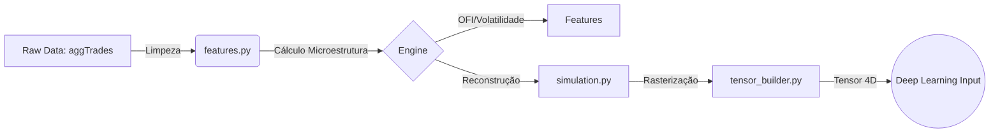

# 📙 SAIMP: Data Structuring & Simulation Module (CAPÍTULO II)

> **Status**: Concluído (Fase 2) ✅  
> **Versão**: 2.0 (4D Tensor Engine)
> **Dependência**: Requer `COLETA_DADOS_README_CAP_I.md` (Raw Data)

## 1. Visão Geral
Este documento detalha o "Cérebro Analítico" do **SAIMP**. Enquanto o Capítulo I tratou da ingestão bruta, aqui transformamos terabytes de logs financeiros em **Tensores Quadridimensionais (4D)** que a Inteligência Artificial pode "enxergar".

O objetivo é converter eventos discretos (trades, ordens) em uma representação contínua e densa (imagens multibanda), permitindo o uso de arquiteturas de Visão Computacional (ViViT/CNN).

### Filosofia da Simulação
Como não temos o Order Book completo (Depth) de anos passados com granularidade fina, utilizamos o conceito de **Restauração de Perfil de Volume**:
- **Trade = Erosão**: Cada trade agressivo "cavou" um buraco na liquidez.
- **Inversão Lógica**: Se houve um *Market Buy* de 10 BTC, sabemos que existia um *Limit Sell* (Ask) naquele preço.
- **Resultado**: Recriamos a silhueta das montanhas de liquidez apenas olhando para onde a água (trades) bateu.

## 2. Arquitetura de Processamento

### Stack Tecnológica
- **Engine Vetorial**: `Polars` (Lazy Evaluation para Big Data).
- **Matemática**: `NumPy` (Álgebra Linear e Log-Transforms).
- **Output**: Tensores `(Tempo, Canais, Altura)`.

### O Pipeline de Refinaria (ETL)


## 3. Engenharia de Features (O Motor Alpha)

Implementada em `src/processing/features.py`, extraímos sinais invisíveis a olho nu:

### A. OFI (Order Flow Imbalance)
É o "vento" que empurra o preço. Mede o desequilíbrio entre a agressão de compra e venda.
* **Fórmula**: $OFI_t = Vol_{Buy} - Vol_{Sell}$
* **Interpretação**:
    * $OFI > 0$: Pressão de Compra (Provável alta).
    * $OFI < 0$: Pressão de Venda (Provável baixa).

### B. Volatilidade Local (Log Returns Std)
Mede a turbulência do mercado.
* Usada para normalizar os inputs da rede neural (regime switching).

### C. Proxy de Liquidação
Detecta "explosões" de volume (bursts) em janelas de 1 segundo, indicando cascates de liquidação forçada (Stop Hunts).

## 4. O Simulador de Order Book (`simulation.py`)

Para treinar a IA com anos de dados, criamos o **Volume Profile Reconstructor**.
Este módulo agrupa os trades em janelas de tempo (snapshots) e empilha o volume verticalmente por nível de preço.

* **Input**: Lista de Trades (Preço, Qtd, Quem Agrediu).
* **Processamento**:
    1. Agrupa por Janela (ex: 1 hora).
    2. Separa Volume Maker Buyer (Asks) e Maker Seller (Bids).
    3. Calcula o Fluxo Líquido (OFI) por nível de preço.
* **Output**: Um DataFrame estruturado com arrays de liquidez por snapshot.

## 5. Tensores 4D: A Visão da IA (`tensor_builder.py`)

A maior inovação da Fase 2. A IA não vê apenas preços, ela vê 4 dimensões de mercado simultaneamente.
Cada "pixel" da imagem representa um nível de preço.

### Os 4 Canais (RGB + Alpha do Mercado)

| Canal (Index) | Nome | O que representa? | Significado Visual |
|:---|:---|:---|:---|
| **0** | **Bids (Liquidez Compra)** | Onde os Vendedores bateram. | **Suporte**. Quanto mais brilhante, mais difícil cair. |
| **1** | **Asks (Liquidez Venda)** | Onde os Compradores bateram. | **Resistência**. Quanto mais brilhante, mais difícil subir. |
| **2** | **OFI (Fluxo Líquido)** | Saldo $Buy - Sell$ no nível. | **Direção**. Intensidade do rompimento. |
| **3** | **Activity (Calor)** | Contagem de Trades / Volatilidade. | **Atenção**. Onde a batalha está ocorrendo. |

### Shape Final
$Tensor = (T, 4, 128)$
* **T**: Tempo (Snapshots).
* **4**: Canais (Bids, Asks, OFI, Activity).
* **128**: Níveis de Preço (Altura da imagem).

## 6. Como Executar (Validação)

Para gerar uma amostra visual do que a IA está vendo:

```powershell
# Executar na raiz do projeto
python run_pipeline_v2.py
```

**Saída Esperada**:
1. Leitura de um arquivo parquet histórico.
2. Simulação de ~100 snapshots.
3. Geração de um arquivo `teste_visualizacao_v2.png` com 4 heatmaps.

## 7. Próximos Passos (Fase 3) 🚀

Com os dados estruturados, estamos prontos para a **Inteligência Artificial**.

- [ ] **Data Loader PyTorch**: Criar Dataset/DataLoader customizado que lê os parquets e cospe tensores na GPU on-the-fly.
- [ ] **Modelo ViViT**: Implementar o Video Vision Transformer.
- [ ] **Training Loop**: O script de treino que fará a IA aprender a ler o fluxo.

---
> *SAIMP - Onde a Microestrutura encontra o Deep Learning.*
